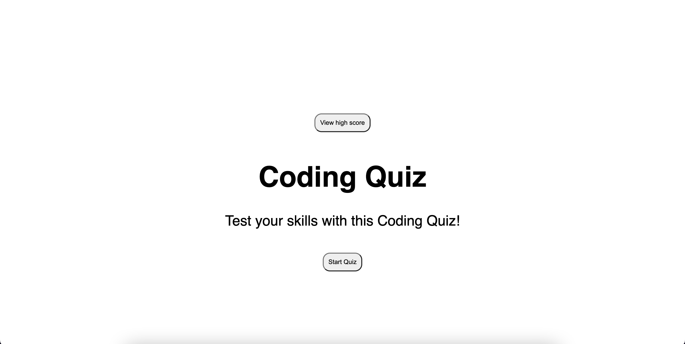

# Coding Quiz

## Description
This is coding quiz which builds on HTML, CSS, and JavaScript. My goal was to learn to build a small quiz game from scratch utilizing the DOM. In building this project I learned more about JS and how it interacts with HTML/CSS.

## Installation

Follow this link to access the quiz: https://jeremiahejensen04.github.io/Javascript-Quiz/

## Usage
Click on the start button to begin quiz. Then click through each question and answer until the quiz ends or you run out of time.